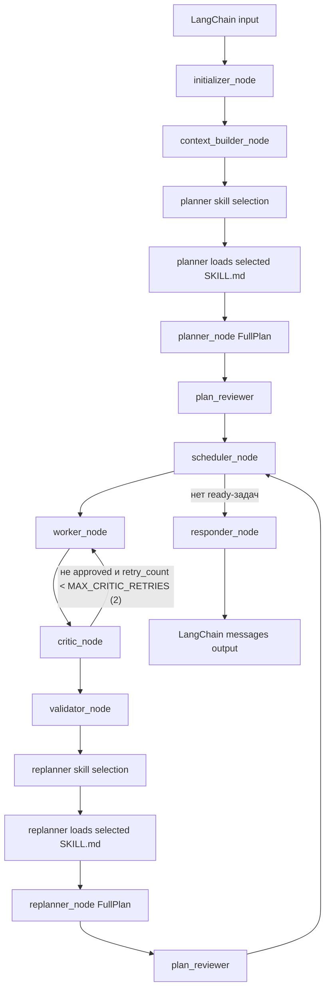
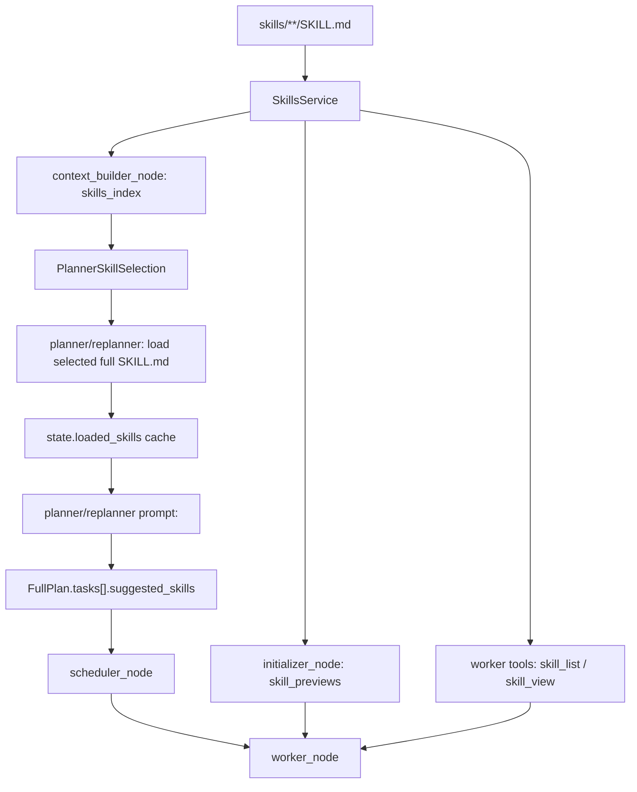

# AnaliticAgenticPlatform

`AnaliticAgenticPlatform` — planner-first аналитический агент на LangGraph и LangChain. Пакет `planner_agent` является самостоятельным **SDK**: LangChain `Runnable`, сохранение `ResearchRun` (план, lineage, snapshots, tools, artifacts, validation, critic, финальный отчёт), read API и опциональный FastAPI-слой без привязки к UI.

Типичный сценарий: короткий запрос пользователя → план → выгрузки через ваши tools → при необходимости код в sandbox → валидация шагов → итоговый markdown через `responder_node`.

## Ключевая идея

Агент используется как обычный LangChain агент:

```python
messages = agent.invoke("Разбери сработку event_id=evt-c42-2025-01-03-block-001")
print(messages[-1].content)
```

При этом внутри одного вызова создается полноценный исследовательский граф:



Узлы **plan_reviewer** на схеме — это шаг `_review_and_revise_plan` внутри общего `planner_node`: он вызывается и при первом планировании, и при `replanner_node` (тот делегирует в `planner_node` с `force_replan=True`), то есть проверка плана идёт **после** генерации `FullPlan`, до перехода к `scheduler`.

Цикл **critic ↔ worker**: в `critic_node` при отклонении результатов worker повторно ставится `Send(worker, …)` пока `task.retry_count < MAX_CRITIC_RETRIES` (в коде `MAX_CRITIC_RETRIES = 2`) и есть инструкции для доработки — не более **двух** дополнительных запусков worker на ту же задачу; затем поток идёт в **validator**.

Основной цикл исполнения:

```text
scheduler -> worker -> critic <-> worker (до 2 ретраев critic) -> validator -> replanner
  -> (skill selection -> FullPlan -> plan_review) -> scheduler -> … -> responder
```

`responder_node` работает как ReAct-агент: получает стартовый контекст (запрос, full_result/result_preview/error_log по задачам, id и метаданные artifacts), при необходимости читает данные через runtime `artifact_*` tools и завершает отчет через `submit_final_report`.

## Песочница, разрешённые библиотеки и подсказка worker-у по pip-пакетам

`ClientPythonSandbox` (`sandbox/sandbox.py`) задаёт среду исполнения сгенерированного кода:

- **`allowed_libraries`**: либо множество имён модулей, разрешённых к импорту, либо **словарь** `{имя_в_globals: объект}` — в этом случае объекты попадают в `globals` песочницы (типичный пример: `{"pd": pd, "px": px}`), а множество разрешённых имён строится по **ключам** словаря. Обёртка `BaseCodeExecutorTool` (`sandbox/executor.py`) передаёт во внешний генератор кода краткую строку с этими именами (`_get_used_library_context`), чтобы MCP/LLM не предлагали запрещённые импорты.
- **`get_installed_packages()`**: статический метод, возвращает `{имя_дистрибутива: версия}` через `importlib.metadata.distributions` (аналог `pip freeze`, без subprocess). **Worker** перед каждым ReAct-запуском вызывает `sandbox.get_installed_packages()` и вставляет результат в системный промпт блоком `<available_python_packages>` (см. `_format_installed_packages` в `planner_agent/agent_nodes/worker_node.py`), чтобы модель знала, какие пакеты реально можно импортировать при вызове `generate_python_code` / исполнителя кода.

Ожидаемый контракт песочницы для графа зафиксирован в `planner_agent/runtime/sandbox.py` (`PythonSandboxProtocol`): помимо превью переменных нужны `get_installed_packages`, `add_variable`, `get_variable`. Если вы используете **минимальную заглушку** (как `SmokeSandbox` в `main_deepseek_test.py`), добавьте к ней `get_installed_packages` (например, делегируя к `ClientPythonSandbox.get_installed_packages()`), иначе при доходе до worker узла возможна ошибка атрибута.

## Подробный цикл выполнения

Ниже описан полный runtime-путь одного пользовательского запроса.

### 1. LangChain вход

Пользовательский код или внешний сервис вызывает `ResearchAgent` как обычный `Runnable`:

```python
messages = agent.invoke(
    "Разбери сработку event_id=evt-c42-2025-01-03-block-001",
    config={"recursion_limit": 60},
)
```

`ResearchAgent` нормализует вход в `AgentState`: строку, `dict`, `ResearchAgentInput` или готовый `AgentState`.

### 2. Initializer

`initializer_node` создает или продолжает `ResearchRun` и собирает стартовый context snapshot:

- `run_id`;
- исходный пользовательский запрос;
- preview sandbox-переменных;
- `filesystem_context`;
- `skill_previews`.

Актуальная логика skills discovery:

- если в фабрике есть `SkillsService`, previews строятся через `skills_service.build_skill_previews()`;
- previews строятся по всем `skills/**/SKILL.md`;
- имя skill берется из YAML frontmatter `name`, а не только из имени директории;
- `skills/README.md` не считается skill.

### 3. Context builder

`context_builder_node` фиксирует воспроизводимый контекст запуска:

- `memory_snapshot`;
- `skills_index`;
- lineage node `research_context_built`.

`skills_index` - компактный список доступных skills с описаниями. Он нужен planner/replanner для выбора релевантных методик.

### 4. Planner skill selection

Перед построением `FullPlan` planner делает отдельный структурированный вызов LLM по схеме `PlannerSkillSelection`.

На вход selection получает:

- `skills_index`;
- `skill_previews`;
- список уже загруженных `state.loaded_skills`;
- исходный запрос;
- текущий план;
- результаты выполнения;
- доступные tools;
- critic feedback.

Selection возвращает:

```json
{
  "skill_names": ["fraud-case-analysis"],
  "rationale": "Skill помогает выбрать источники, порядок анализа и validation criteria."
}
```

Runtime загружает максимум `MAX_PLANNER_LOADED_SKILLS` full skills. Если skill уже есть в `state.loaded_skills`, используется cached content и повторного `skill_view()` не происходит.

### 5. Planner / Replanner prompt

После skill selection planner/replanner строит основной prompt. В него попадает:

- исходный запрос;
- текущий план;
- initial plan;
- execution results;
- `filesystem_context`;
- `data_schemas`;
- `skills_index`;
- `skill_previews`;
- `<planner_loaded_skills>` с полным текстом выбранных `SKILL.md`;
- tools description;
- previous dialog/branch context;
- critic feedback;
- JSON schema `FullPlan`.

`<planner_loaded_skills>` используется только как методика планирования: он помогает выбрать источники, зависимости, recovery-стратегии, validation criteria и `suggested_skills`. Skill не заменяет фактические данные.

### 6. Plan review

После генерации candidate plan отдельный reviewer проверяет план до выполнения.

Reviewer помечает план как проблемный, если:

- шаги слишком общие;
- шаги бессмысленно мелкие;
- отсутствует обязательная выгрузка/проверка/расчет;
- worker-у поручен финальный пользовательский отчет;
- есть failed-задача без recovery;
- candidate plan завершает выполнение, хотя failed-задача должна была получить обязательные данные.

Если `needs_revision=true`, planner делает одну revision-попытку и возвращает исправленный `FullPlan`.

### 7. Scheduler

`scheduler_node` выбирает ready tasks:

- задача должна быть `pending` или `ready`;
- все dependencies должны быть `completed`;
- failed dependency не считается надежным входом;
- независимые задачи отправляются параллельно.

Если `pending`/`ready` задача заблокирована `failed`, `skipped` или отсутствующей зависимостью, scheduler не завершает run как "нет исполнимых задач". Он формирует `feedback_context` с диагностикой блокировки и отправляет управление в `replanner`, чтобы тот создал replacement/retry-задачу или переподключил downstream-зависимости.

Для каждого worker собирается `WorkerPayload`: task, context schemas, previous results, resolved inputs, dependency context, filesystem context, skill previews и artifact context.

### 8. Worker

`worker_node` выполняет одну узкую задачу.

**Сборка системного промпта** (после подстановки в шаблон `prompts.worker_system` полей `{task_description}`, `{task_config}`, `{schema_text}`, `{previous_results}`):

1. `<task_contract>` — `expected_output`, `validation_criteria`, `required_artifacts`, `suggested_tools`, `suggested_skills`.
2. `<resolved_inputs>` — скаляры для вызовов tools (из dependency context / config).
3. `<dependency_context>` — цепочка предков, статусы, превью результатов, `artifact_refs`.
4. `<filesystem_context>` — пути workspace, sources, contexts, skills.
5. `<artifact_context>` — отобранные artifacts и правила использования.
6. Превью skills (`_format_skill_previews`).
7. `<loaded_skills>` — полные `SKILL.md` по `task.suggested_skills` (через `SkillsService`).
8. **`<available_python_packages>`** — результат `sandbox.get_installed_packages()` (см. раздел про песочницу).

Далее worker получает инструменты:

- task contract;
- resolved inputs;
- dependency context по всей цепочке предков;
- artifact context;
- filesystem context;
- skill previews;
- full skills, если они указаны в `task.suggested_skills`;
- runtime tools `skill_list` и `skill_view`;
- runtime artifact tools;
- domain/source tools.

Worker может:

- вызвать source/export tool;
- прочитать artifact;
- вызвать `skill_view`, если preview недостаточно и full skill не был загружен автоматически;
- использовать `generate_python_code` для расчетов по уже доступным данным;
- создать новый artifact.

### 9. Tool/artifact capture

Все обычные LangChain tools проходят через artifact wrapper:

- маленький результат остается inline;
- большой результат сохраняется как artifact;
- worker получает `artifact_id`, `uri`, `summary`, признаки truncation и scope.

Это позволяет не забивать LLM context большими таблицами и при этом не терять данные.

### 10. Critic (после worker)

`critic_node` вызывается **сразу после** `worker_node` для той же задачи: отдельный LLM-вызов со structured output `WorkerCriticReview` (`approved`, `issues`, `improvement_instructions`).

- Если `approved=false` и выполняются условия ретрая (`task.retry_count < MAX_CRITIC_RETRIES`, в коде лимит **2**, и есть текст доработки), граф снова отправляет ту же задачу в **worker** (цикл «диалог» critic ↔ worker).
- Иначе задача передаётся в **validator** (`ValidatorPayload`).

Это не финальный «критик плана»: накопленный critic/worker feedback дальше может попадать в prompt **replanner** через состояние, но узел `critic` в графе отвечает именно за приёмку результата worker до валидации.

### 11. Validator

`validator_node` идёт **после** critic-цикла и проверяет, выполнена ли задача:

- есть ли результат, а не только план действий;
- соответствует ли результат task description;
- использованы ли нужные inputs/artifacts;
- достаточно ли данных для этой задачи;
- можно ли пометить task как `completed`.

После validator переход всегда в **replanner** (обновить план с учётом успеха/провала шага).

### 12. Replanner и plan review

`replanner_node` — обёртка над тем же `planner_node` с `force_replan=True`: снова skill selection, загрузка выбранных `SKILL.md`, генерация `FullPlan`, затем **тот же plan review** (`plan_reviewer_system` / `_review_and_revise_plan`), что и у первичного planner. То есть проверка плана выполняется **после** шага генерации плана при replan, до возврата в **scheduler**.

Replanner должен:

- сохранить completed задачи;
- не переводить выполненные задачи обратно в pending;
- не ставить новые задачи в зависимость от failed-задачи, если есть replacement;
- не завершать план только потому, что runnable-задач нет, если причина в failed dependency;
- создать recovery/replacement задачу для обязательных данных или явно зафиксировать невозможность.

### 13. Responder

`responder_node` получает сводку по всем задачам плана (приоритетно `full_result`), каталог artifacts и ограничения, затем при необходимости вызывает runtime tools чтения artifacts.

Responder формирует:

- `final_report`;
- artifact `final_report.md`;
- artifact `final_report_context.md`.

`final_report_context.md` показывает стартовый контекст responder: user query, worker task outputs (с приоритетом `full_result`), artifact catalog и planning errors.

### 14. LangChain выход

`ResearchAgent` возвращает обычный `list[BaseMessage]`. Последнее сообщение содержит финальный отчет.

## Детальная маршрутизация графа (Command / Send)

Скомпилированный граф имеет явное ребро только `START → initializer`. Все остальные переходы задаются через `Command` и `Send` из узлов.

| Узел | Условие / действие | Куда ведёт (`goto`) | Что критично в `update` |
|------|-------------------|---------------------|-------------------------|
| `initializer` | старт | `context_builder` | `run_id`, `data_schemas` (превью sandbox), `global_vars`, `filesystem_context`, `skill_previews`, lineage |
| `context_builder` | всегда | `planner` | `memory_snapshot`, `skills_index`, lineage |
| `planner` | план ОК | `scheduler` | `plan`, messages, `loaded_skills`, lineage |
| `planner` | ошибка планирования | `responder` | сообщение об ошибке, переход к финальному отчёту |
| `scheduler` | план пуст | `responder` | AIMessage: пустой план |
| `scheduler` | все задачи в терминальном статусе | `responder` | — |
| `scheduler` | есть ready-задачи | список `Send("worker", WorkerPayload)` | патч `plan` → задачи в `RUNNING`, lineage `task_scheduled` |
| `scheduler` | есть `RUNNING` / `NEEDS_VALIDATION`, но нечего ставить в очередь | `Command(update={})` | **пустой update** — граф ждёт завершения параллельных веток |
| `scheduler` | иначе (нет исполнимых задач) | `responder` | AIMessage: нет исполнимых задач |
| `worker` | после ReAct | список `Send("critic", CriticPayload)` | обновление `plan` для задачи, `data_schemas`, опционально `artifact_index`, `loaded_skills`, `tool_traces`, lineage |
| `critic` | не одобрено и можно ретрай | `Send("worker", WorkerPayload)` | `retry_count++`, задача снова `READY`, в `task.config` кладётся `critic_feedback`, сброс результатов |
| `critic` | одобрено или лимит ретраев | `Send("validator", ValidatorPayload)` | `feedback_context` при наличии замечаний |
| `validator` | всегда | `replanner` | статус задачи `completed` / `failed`, метрики валидации |
| `replanner` | внутри тот же `planner_node` с `force_replan=True` | `scheduler` или `responder` | как у planner |
| `responder` | конец | *(нет `goto` → завершение графа)* | `final_report`, artifacts, сообщения |

**Параллельность:** несколько независимых задач получают одновременно `Send("worker", …)` из одного вызова `scheduler`.

**Цикл critic ↔ worker:** не более `MAX_CRITIC_RETRIES` повторных отправок в worker (в коде лимит **2**), при наличии непустых `improvement_instructions`.

## Формирование контекстов по узлам (пошагово)

### Planner / Replanner (один узел `planner_node`, у replanner `force_replan=True`)

1. **Skill selection** (structured `PlannerSkillSelection`): в промпт попадают `skills_index`, `skill_previews`, уже загруженные skills, запрос, сводка плана, результаты исполнения, описание tools, critic feedback (см. `_format_critic_feedback`).
2. Загрузка до `MAX_PLANNER_LOADED_SKILLS` полных `SKILL.md` в `state.loaded_skills` (кеш).
3. Основной вызов LLM → `FullPlan` (JSON по схеме).
4. **Plan review** (`PlanReview`): при `needs_revision` — одна попытка пересборки плана с подсказкой reviewer.
5. В промптах планировщика используются блоки: пользовательский запрос, текущий/initial план, execution results, `filesystem_context`, `data_schemas`, `skills_index`, previews, `<planner_loaded_skills>`, список tools, предыдущий диалог / branch context (`_format_context`), critic feedback.

### Scheduler

Для каждой задачи в `PENDING`/`READY` с **всеми** зависимостями в `COMPLETED`:

- строится множество видимых имён переменных: стартовые `global_vars` ∪ `output_variable_name` всех предков;
- `context_schemas` — фильтр `state.data_schemas` по этим именам;
- `previous_results` — конкатенация текстов результатов по цепочке предков (`_collect_ancestor_data`);
- `resolved_inputs` и структурированный `dependency_context` — разбор результатов и конфигов;
- `artifact_context` — выбор релевантных artifacts (лимиты в `scheduler_node`);
- в `WorkerPayload` также копируются `run_id`, `parent_node_ids` (lineage), `skill_previews`, `filesystem_context`.

### Critic

Вход: `CriticPayload` с исходным `WorkerPayload`, снимком `artifact_index`, `tool_traces`, structured tool calls ReAct. Выход: `WorkerCriticReview`. При ретрае в worker уходит **тот же** контекстный пакет (с обновлённым `task.config`), плюс очищаются прошлые результаты задачи.

### Validator

Вход: `ValidatorPayload` (задача после critic). Отдельный structured-вызов LLM → `StepValidation`; задача переводится в `completed` или `failed`; переход **всегда** в `replanner`.

### Responder

`responder_node` запускает ReAct-агента (`create_react_agent`) с системным промптом `prompts.responder_system` и дополнительными execution-правилами для responder.

Стартовый human-message собирается из:
- `<user_query>`;
- `<worker_task_outputs>` (все задачи плана, приоритет текста: `full_result`, затем `result_preview`, для failed — `error_log`);
- `<artifact_catalog>` (только id и метаданные, без подмешивания содержимого файлов);
- `<planning_error>`.

Контекст ужимается под бюджет `RESPONDER_PROMPT_BUDGET_CHARS`.

У responder доступны инструменты:
- `submit_final_report` (обязательный финальный вызов с markdown-отчетом);
- runtime `artifact_*` tools (`artifact_list`, `artifact_preview`, `artifact_read_chunk`, `artifact_profile`, `artifact_sample`, `artifact_search`, `artifact_value_counts`) для чтения артефактов по требованию.

Итоговый markdown берётся из `submit_final_report`; fallback допускается из финального AI-сообщения, если tool не был вызван. Параллельно сохраняется `final_report_context.md` с тем, что именно видел responder на старте.

## Текущий статус

Готово:

- LangChain-compatible facade `ResearchAgent`.
- Поддержка `invoke`, `ainvoke`, `batch`, `abatch`, `stream`, `astream`.
- Planner-first LangGraph workflow.
- Review плана перед выполнением: отдельная критика плана на слишком общие, слишком мелкие или пропущенные шаги.
- Worker execution через ReAct agent.
- Validation каждого worker-result.
- Critic **после каждого** worker-шага: приёмка результата до validator; при отклонении — до двух ретраев worker с инструкциями в `task.config`.
- Replanning с сохранением completed задач и добавлением retry/replacement задач.
- Сквозная передача контекста зависимостей worker-ам.
- Двухуровневая работа со skills: planner/replanner сначала выбирает релевантные skills, затем загружает full `SKILL.md` перед построением плана.
- Кеширование `loaded_skills`: повторная загрузка одного и того же skill через `skill_view()` не выполняется.
- Worker получает previews skills, автоматически загружает skills из `suggested_skills` и может сам вызвать runtime tools `skill_list` / `skill_view`.
- Artifact store для больших outputs, tool results, worker outputs, generated code и responder context.
- Runtime artifact tools: preview, read chunk, profile, sample, search, value counts.
- Runtime skill tools: `skill_list`, `skill_view`.
- Responder execution через ReAct agent с `submit_final_report` и artifact tools.
- Read API на `ResearchAgent` и опциональный REST-слой `planner_agent.http_api` (FastAPI).
- Branch/dialog context поверх существующих runs.
- Поддержка code generator tool через sandbox wrapper.

Не является основной частью runtime сейчас:

- Self-improvement loop.
- Автоматическая оценка качества по scoring-системе.
- Жесткий deterministic evidence checker.
- Специализированные внешние агенты коллег. Их можно будет подключать позже как обычные LangChain/MCP tools без изменения основного контракта.

## Быстрый старт

Установка (только SDK):

```powershell
python -m venv .venv
.\.venv\Scripts\activate
pip install -e .
```

Опционально HTTP API (FastAPI + uvicorn):

```powershell
pip install -e ".[api]"
```

Проверка тестами (нужен интерпретатор с UTF-8, см. переменную окружения `PYTHONUTF8=1` на Windows при падениях строковых assert):

```powershell
python -m unittest discover -s tests
```

### Скрипты и примеры из корня репозитория

| Команда | Назначение |
|---------|------------|
| `python main_deepseek_test.py` | Smoke с реальной моделью из `model.py`, fake Spark tools, `SmokeSandbox` (dataframe в памяти). |
| `python main_sandbox_code_example.py` | Демо `ClientPythonSandbox` + обёртка `generate_python_code`, данные из CSV. |
| `python main_e2e_branch_dialog.py` | Полный сценарий: базовый run → `invoke_branch` → follow-up с историей. |
| `python main_mvp_e2e_check.py` | MVP без LLM: детерминированный graph, проверки invoke/branch/dialog **и** HTTP client. |
| `python main_ui_agent_server.py` | Поднимает FastAPI с реальным `ResearchAgent` (fake Spark + MCP code tools на `127.0.0.1:8201`). |
| `python examples/branch_from_graph_step_demo.py` | Проверка `LineageService.branch_from` для произвольного шага графа (без UI). |

Для сценариев с реальной моделью нужны ваши ключи и рабочий `model.py`. Для `main_ui_agent_server.py` дополнительно должен быть доступен MCP-сервер генерации кода на порту **8201**.

### Опциональный REST-слой

Модуль `planner_agent.http_api` поднимает операции поверх тех же сервисов, что и `ResearchAgent`. Префикс по умолчанию: `/api/v1` (см. `ApiSettings`).

Основные методы (префикс по умолчанию `/api/v1`, задаётся `ApiSettings.api_prefix`):

- `GET {prefix}/health`
- `POST {prefix}/runs/invoke` — тело `AgentInvokeRequest`: `user_query`, `session_id`, `user_id`, `filesystem_context`, `context_runs`.
- `POST {prefix}/runs/live` — фоновый запуск: сразу возвращает `run_id`, далее опрос `GET {prefix}/runs/{run_id}/graph`.
- `GET {prefix}/runs`, `GET {prefix}/runs/{run_id}`, `.../result`, `.../graph`, `.../nodes`, `.../nodes/{node_id}`, `.../inspector`, `.../artifacts`, preview/text/file артефактов.
- `POST {prefix}/branches` — создать метаданные ветки; `POST {prefix}/branches/invoke` — создать и сразу выполнить (`BranchRequest`).
- `POST {prefix}/dialog-context` — превью dialog context без запуска графа.
- `GET/POST/DELETE {prefix}/skills` — HTTP-обёртка над skills store (список, просмотр по имени, создание, удаление).

Полный перечень см. `planner_agent/http_api/app.py`.

Пример (см. также `main_ui_agent_server.py`):

```powershell
python -m uvicorn main_ui_agent_server:create_app_with_agent --factory --host 127.0.0.1 --port 8000
```

HTTP-слой не монтирует frontend-статику. UI можно держать отдельным приложением, которое обращается к этим endpoints.

### Вспомогательный запуск без фасада

`planner_agent/chat_runner.py`:

- `build_chat_initial_state(user_query, session_id=..., user_id=..., filesystem_context=...)`
- `run_chat_agent(graph, user_query, ...)` / `run_agent_from_state(graph, state, config=...)`

Используется в тестах и кастомных обвязках, когда граф передаётся явно.

## Использование как обычного LangChain агента

### Параметры `ResearchAgent.__init__` и сборки графа

Публичный конструктор (`planner_agent/research_agent.py`) принимает:

| Параметр | Значение |
|----------|----------|
| `model` | `BaseChatModel` для planner, worker, validator, critic, responder (обязателен, если не передан `graph`). |
| `sandbox` | Объект песочницы по контракту `PythonSandboxProtocol` (обязателен без `graph`). |
| `tools` | Список внешних LangChain tools; имена из `code_generator_tool_names` оборачиваются в `BaseCodeExecutorTool`. |
| `prompts` | Экземпляр `AnalysisAgentPrompts`; по умолчанию встроенные шаблоны из `prompts.py`. |
| `code_generator_tool_names` | Множество имён tools-генераторов кода; по умолчанию `{"generate_python_code"}`. |
| `enable_workspace_tools` | Добавлять ли tools чтения/записи workspace (`build_workspace_tools`). По умолчанию `True`. |
| `workspace_root` | Корень workspace (абсолютный путь нормализуется). |
| `sources_dir` | Источники данных; по умолчанию `<workspace>/sources`. |
| `contexts_dir` | Контексты; по умолчанию `<workspace>/contexts`. |
| `runs_dir` | Каталог runs; по умолчанию `<workspace>/runs`. |
| `memory_dir` | Каталог memory; по умолчанию `<workspace>/memory`. |
| `skills_dir` | Каталог skills; по умолчанию `<workspace>/skills`. |
| `lineage_service`, `artifact_service`, `memory_service`, `skills_service` | Опциональная подмена сервисов (иначе создаются от путей выше). |
| `tool_registry` | Опциональный `ToolRegistry` для регистрации всех worker-tools. |
| `enabled_tool_names` | Подмножество имён tools, доступных после `register_many` (whitelist). |
| `graph` | Если задан — **ни модель, ни sandbox не нужны**: используется готовый скомпилированный граф (тесты, MVP). |

Внутри `planner_agent/factory.py` в `filesystem_context` initializer всегда попадают как минимум: `workspace_root`, `sources_dir`, `contexts_dir`, `skills_dir` (абсолютные пути).

### Способы вызова Runnable

Методы экземпляра `ResearchAgent`:

- `invoke(input, config=None, **kwargs)` / `ainvoke(...)` — основной путь.
- `batch(inputs, config=..., **kwargs)` / `abatch(...)` — список независимых запросов; `config` может быть одним или списком по длине `inputs`.
- `stream(input, ...)` / `astream(...)` — обёртка: один chunk с **полным** результатом после завершения графа (как у `invoke`).

**Допустимые формы `input`:** `str`, `dict` (валидируется как `ResearchAgentInput`), готовый `AgentState`, сам `ResearchAgentInput`.

**Ключи dict:** используются только поля `ResearchAgentInput`, например `user_query`, `session_id`, `user_id`, `filesystem_context`, `context_runs` и `state`.

**`kwargs` для `invoke`/`ainvoke`:** извлекаются только `user_query`, `session_id`, `user_id`, `filesystem_context`; остальные ключи **игнорируются** (не передаются в граф).

**LangGraph `config`:** типично `{"recursion_limit": 60}` (лимит шагов графа и вложенного ReAct worker).

**Ветвление:** `branch_from(request: BranchRequest) -> ResearchRun`, `build_branch_state(branch_run_id, branch_node_id=None)`, `invoke_branch` / `ainvoke_branch` — принимают `BranchRequest`, создают новый run и запускают граф от snapshot.

**Follow-up по прошлым runs:** в dict-входе поле `context_runs: list[ContextRunRef]`; сервис собирает текст в `state.ephemeral_recalls["dialog_context"]` и дублирует в `filesystem_context["dialog_context"]`.

### Минимальная инициализация

```python
from planner_agent import ResearchAgent
from model import model as llm
from sandbox import ClientPythonSandbox
from examples.fake_spark_tools import build_fake_spark_tools


sandbox = ClientPythonSandbox()

agent = ResearchAgent(
    model=llm,
    sandbox=sandbox,
    tools=build_fake_spark_tools(),
    workspace_root=".",
    sources_dir="examples/data",
    contexts_dir="skills",
    skills_dir="skills",
    memory_dir="memory",
    runs_dir="examples/runs",
)

messages = agent.invoke(
    "Разбери сработку event_id=evt-c42-2025-01-03-block-001: "
    "это обычная операция клиента или нет, и что могло привести к блокировке?",
    config={"recursion_limit": 60},
)

print(messages[-1].content)
```

Важно: агент не обязан получать DataFrame в sandbox при старте. Базовый путь - загрузка данных через source/export tools. Sandbox нужен для исполнения generated code и хранения переменных, созданных в ходе исследования.

### Вход через dict

```python
messages = agent.invoke(
    {
        "user_query": "Проверь, является ли операция клиента обычной",
        "session_id": "analyst-session-001",
        "user_id": "analyst-42",
    },
    config={"recursion_limit": 60},
)
```

### Async

```python
messages = await agent.ainvoke(
    "Найди повторяющиеся паттерны по клиенту и объясни блокировку",
    config={"recursion_limit": 60},
)
```

### Batch

```python
batch_results = agent.batch(
    [
        "Разбери сработку event_id=evt-1",
        "Разбери сработку event_id=evt-2",
    ],
    config={"recursion_limit": 60},
)
```

## Инициализация с code generator tool

Если передать tool с именем из `code_generator_tool_names`, агент обернет его в executor tool. Тогда worker вызывает один инструмент, а wrapper генерирует код и исполняет его в sandbox.

```python
from langchain_core.tools import StructuredTool
from pydantic import BaseModel, Field
from planner_agent import ResearchAgent
from sandbox import ClientPythonSandbox
from model import model as llm


class CodeGeneratorInput(BaseModel):
    """Аргументы инструмента генерации Python-кода."""

    task: str = Field(description="Полное описание вычислительной задачи.")
    schema_context: str = Field(description="Доступные переменные, artifacts и типы данных.")
    target_variable: str = Field(description="Имя переменной результата.")
    previous_code: str | None = Field(default=None, description="Код прошлой попытки.")
    error_context: str | None = Field(default=None, description="Ошибка прошлой попытки.")
    used_library: str | None = Field(default=None, description="Библиотеки, которые можно использовать.")


async def generate_python_code(
    task: str,
    schema_context: str,
    target_variable: str,
    previous_code: str | None = None,
    error_context: str | None = None,
    used_library: str | None = None,
) -> str:
    """Возвращает Python-код, который создаст переменную target_variable."""

    return f"{target_variable} = {{'status': 'demo', 'task': {task!r}}}"


code_tool = StructuredTool.from_function(
    coroutine=generate_python_code,
    name="generate_python_code",
    description=(
        "Генерирует исполняемый Python-код для расчетов, join, агрегатов, "
        "проверок и анализа уже доступных данных или artifacts. Не является "
        "инструментом загрузки данных из источника."
    ),
    args_schema=CodeGeneratorInput,
)

sandbox = ClientPythonSandbox()

agent = ResearchAgent(
    model=llm,
    sandbox=sandbox,
    tools=[code_tool],
    code_generator_tool_names={"generate_python_code"},
    workspace_root=".",
    skills_dir="skills",
    memory_dir="memory",
    runs_dir="examples/runs",
)
```

Правило использования: source/export tools должны получать данные из баз и Spark с фильтрами на стороне источника. `generate_python_code` нужен для вычислений по уже полученным данным, artifacts или sandbox-переменным.

## Структура проекта (SDK)

```text
AnaliticAgenticPlatform/
  planner_agent/          # ядро: граф, узлы, сервисы, промпты
    agent_nodes/          # initializer, planner, scheduler, worker, critic, validator, replanner, responder
    http_api/             # опциональный FastAPI (invoke, runs, branch, skills HTTP)
    runtime/              # capture tool results, permissions, workspace helpers
    schemas/              # pydantic: lineage, artifacts, skills, …
    services/             # lineage, artifacts, memory, skills, inspection, branch, dialog context
    tools/                # artifact read tools, wrappers, skill_list/skill_view
    factory.py            # сборка скомпилированного графа
    graph.py
    models.py             # AgentState, Task, FullPlan, payloads узлов
    research_agent.py     # публичный LangChain Runnable + read API
    structured_output.py  # invoke LLM → Pydantic
    prompts.py
  sandbox/                # исполнение generated code (ClientPythonSandbox, executor)
  portable_agent_patterns/  # переиспользуемые паттерны (skills, memory, tool runtime)
  skills/                 # SKILL.md для planner/worker
  memory/                 # файлы снимка памяти
  examples/               # демо-данные и примеры прогонов (runs обычно не коммитятся)
  tests/
  main_*.py               # точки входа для локальных демо
```

Каталог `ui/` (если есть) — внешний фронтенд; в поставку пакета `research-agent` не входит.

## Ответственность слоев

### Public API layer

`planner_agent/research_agent.py`

Отвечает за совместимость с LangChain:

- принимает `str`, `dict`, `ResearchAgentInput`, `AgentState`;
- реализует `invoke`, `ainvoke`, `batch`, `abatch`, `stream`, `astream`;
- возвращает `list[BaseMessage]`;
- хранит `last_state` и `last_run_id`;
- предоставляет read API: `get_run_result`, `get_run_graph`, `get_node_details`, `get_node_inspector_view`, `list_artifacts`, `get_artifact_details`, `preview_artifact`, `get_final_report`;
- поддерживает `invoke_branch` и `ainvoke_branch`.

`planner_agent/factory.py`

Собирает LangGraph workflow:

- создает services;
- резолвит директории;
- подготавливает tools;
- оборачивает code generator tools в executor;
- добавляет workspace tools;
- регистрирует узлы графа.

`planner_agent/http_api/`

Опциональный FastAPI-слой (`create_app`, `ApiSettings`, `ApiServices`): REST endpoints поверх тех же сервисов, что и `ResearchAgent`, без зависимости от фронтенда. Зависимости: extra `[api]` в `pyproject.toml`.

### Agent nodes layer

`initialize_node.py`

Стартовый узел. Собирает:

- `run_id`;
- `global_vars`;
- previews sandbox-переменных;
- `filesystem_context`;
- `skill_previews`;
- начальный lineage `run_started` или `context_snapshot`.

`skill_previews` строятся через `SkillsService.build_skill_previews()` по всем файлам `skills/**/SKILL.md`. Имя skill берется из YAML frontmatter `name`, если оно указано; иначе используется имя директории.

`context_builder_node.py`

Фиксирует контекст исследования:

- `memory_snapshot` из `memory/`;
- `skills_index` из `skills/`;
- lineage `research_context_built`.

`skills_index` является компактной картой доступных навыков для planner/replanner. Он не подменяет full `SKILL.md`: полный текст загружается отдельным шагом только для выбранных навыков.

`planner_node.py`

Создает `FullPlan`:

- objective;
- tasks;
- dependencies;
- expected output;
- validation criteria;
- suggested tools;
- suggested skills;
- required artifacts;
- config.

Перед созданием плана planner выполняет отдельный шаг выбора навыков:

1. получает `skills_index`, `skill_previews` и список уже загруженных `state.loaded_skills`;
2. возвращает `PlannerSkillSelection`;
3. загружает full `SKILL.md` только для выбранных skills;
4. добавляет их в prompt как `<planner_loaded_skills>`;
5. переиспользует cached content из `state.loaded_skills`, если skill уже был загружен.

Перед выполнением план проходит `plan_reviewer_system`: reviewer критикует план на слишком общие шаги, слишком мелкие шаги, пропущенные источники, неправильные зависимости и задачи финального отчета, которые должен делать responder.

`scheduler_node.py`

Выбирает готовые задачи:

- проверяет, что все dependencies завершены;
- собирает транзитивный контекст всех предков;
- извлекает `resolved_inputs` из структурированных результатов;
- собирает `artifact_context`;
- передает `skill_previews` в worker;
- запускает независимые задачи параллельно.

`worker_node.py`

Выполняет одну задачу:

- получает `WorkerPayload`;
- выбирает только нужные domain/source tools;
- добавляет runtime artifact tools;
- получает preview доступных skills;
- автоматически загружает full skill content по `task.suggested_skills`;
- может вручную вызвать runtime tools `skill_list` и `skill_view`;
- формирует prompt;
- запускает ReAct worker;
- сохраняет tool outputs и worker output как artifacts;
- создает lineage `worker_started` и `task_completed` или `task_failed`.

`critic_node.py`

Предварительная приёмка результата **одной** worker-задачи **до** validator:

- вход `CriticPayload` (задача, артефакты и tool traces этого шага, список tools);
- structured output `WorkerCriticReview`;
- при отклонении — до `MAX_CRITIC_RETRIES` повторных `Send` в **worker** с инструкциями в `task.config`;
- иначе — `Send` в **validator**.

`validator_node.py`

Проверяет worker-result **после** critic-цикла:

- соответствует ли ответ задаче;
- есть ли содержательный результат, а не только план действий;
- достаточно ли данных;
- выставляет `completed` / `failed` и метрики валидации;
- переход всегда в **replanner**.

`replanner_node.py`

Вызывает `planner_node` с `force_replan=True` (те же skill selection, `FullPlan` и **plan review**), затем переход в **scheduler**:

- сохраняет completed задачи;
- не возвращает выполненные задачи обратно в pending;
- не создает зависимости от будущих задач;
- добавляет retry/replacement tasks с новой стратегией;
- завершает план, если responder уже может ответить.

`responder_node.py`

Формирует финальный отчет:

- получает исходный запрос;
- собирает по всем задачам сводку с приоритетом `full_result` и id артефактов;
- передает в responder каталог artifacts (id и метаданные);
- запускает ReAct responder с tools `submit_final_report` + runtime `artifact_*`;
- позволяет дочитать артефакты через tools только при необходимости;
- сохраняет `final_report.md`;
- сохраняет `final_report_context.md`, чтобы можно было увидеть, что именно видел responder.

### Runtime layer

`runtime/tool_result_capture.py`

Перехватывает результаты обычных LangChain tools:

- маленький результат оставляет inline;
- большой результат сохраняет как artifact;
- возвращает worker-у ссылку, `artifact_id`, `uri`, признаки truncation и scope.

`tools/artifact_read_tools.py`

Добавляет runtime tools для чтения artifacts:

- `artifact_list`;
- `artifact_preview`;
- `artifact_read_chunk`;
- `artifact_profile`;
- `artifact_sample`;
- `artifact_search`;
- `artifact_value_counts`.

`tools/artifact_wrappers.py`

Оборачивает внешние tools, чтобы их результаты попадали в artifact pipeline.

`tools/skill_tools.py`

Добавляет runtime tools для worker:

- `skill_list` - показать доступные skills в компактном виде;
- `skill_view` - загрузить full `SKILL.md` по имени директории, file path или `name` из YAML frontmatter.

Эти tools подключаются в `factory.py` к общему набору worker tools и позволяют worker-у запросить навык уже во время выполнения задачи.

### Services layer

`lineage_service.py`

Хранит `ResearchRun`, `StateNode`, snapshots и lineage.

`artifact_service.py`

Хранит artifacts, metadata, checksums и physical files.

`skills_service.py`

Работает с `skills/<skill-name>/SKILL.md`:

- список skills;
- preview всех skills для initializer/worker;
- index для planner/replanner;
- поиск skill по имени директории и по `name` из YAML frontmatter;
- full content для planner/replanner/worker;
- кеширование загруженных skills через `state.loaded_skills`;
- create/patch/delete.

`memory_service.py`

Собирает frozen memory snapshot из `memory/`.

`run_inspection_service.py`

Read-only API для инспекции run (и для HTTP-слоя):

- runs;
- graph;
- node details;
- node inspector view;
- artifacts;
- final report.

`branch_resume_service.py`

Восстанавливает state из snapshot/node для branch-run.

`dialog_context_service.py`

Готовит контекст существующих runs для follow-up диалога.

## Схема данных AgentState

Главное состояние графа находится в `planner_agent/models.py`.

Ключевые поля:

```python
AgentState(
    run_id="...",
    session_id="...",
    user_id="...",
    messages=[...],
    plan={"1": Task(...), "2": Task(...)},
    data_schemas={"df_current": "shape=(100, 8), columns=[...]"},
    filesystem_context={
        "workspace_root": "...",
        "sources_dir": "...",
        "contexts_dir": "...",
    },
    skill_previews={"fraud-case-analysis": "short preview..."},
    memory_snapshot="...",
    skills_index="Available skills:\n- fraud-case-analysis: ...",
    loaded_skills={"fraud-case-analysis": "full SKILL.md content..."},
    artifact_index={"artifact-id": {...}},
    tool_traces=[...],
    lineage_events=[...],
    final_report="...",
)
```

## Что получает planner

Planner работает в два LLM-этапа.

Сначала он выбирает релевантные skills через `PlannerSkillSelection`:

```text
<skills_index>
- fraud-case-analysis: Как разбирать клиентскую сработку...
- ...
</skills_index>

<already_loaded_skill_names>
- fraud-case-analysis
</already_loaded_skill_names>
```

Затем узел planner/replanner загружает full `SKILL.md` для выбранных skills, добавляет их в `<planner_loaded_skills>` и только после этого строит `FullPlan`. Если skill уже есть в `state.loaded_skills`, повторный `skill_view()` не вызывается.

Planner видит не полный мир, а компактный контекст плюс выбранные full skills:

```text
<user_query>
Разбери сработку event_id=evt-c42-2025-01-03-block-001
</user_query>

<available_tools>
- spark_lookup_trigger_cases: найти сработку(и) по event_id или epk_id+event_dt
- spark_get_uko_events: выгрузить UKO-переводы/списания клиента
- spark_get_cards_events: выгрузить карточные операции клиента
- spark_load_csv_source: загрузить CSV-источник в песочницу или preview
- generate_python_code: выполнить расчеты по уже доступным данным
</available_tools>

<available_context>
- workspace_root: C:/...
- sources_dir: C:/.../examples/data
- contexts_dir: C:/.../skills
- skill preview: fraud-case-analysis - как разбирать клиентскую сработку
- memory snapshot: ...
</available_context>

<planner_loaded_skills>
## fraud-case-analysis
...
</planner_loaded_skills>
```

Planner возвращает `FullPlan`:

```json
{
  "objective": "Разобрать сработку и определить обычность операции",
  "tasks": [
    {
      "task_id": "1",
      "description": "Получить детали сработки по event_id",
      "dependencies": [],
      "suggested_tools": ["spark_lookup_trigger_cases"],
      "suggested_skills": ["fraud-case-analysis"],
      "expected_output": "Структура с client_id, event_date, amount, merchant, rule",
      "validation_criteria": ["event_id найден", "client_id и event_date определены"],
      "output_variable_name": "trigger_case_details",
      "config": {"event_id": "evt-c42-2025-01-03-block-001"}
    },
    {
      "task_id": "2",
      "description": "Выгрузить транзакции клиента за период для сравнения паттерна",
      "dependencies": ["1"],
      "suggested_tools": ["spark_get_uko_events"],
      "expected_output": "Список транзакций за выбранный период с фильтрами источника",
      "output_variable_name": "client_transactions_history"
    }
  ]
}
```

## Что получает scheduler

Scheduler получает весь `AgentState.plan`, но запускает только готовые задачи.

Для задачи с dependencies он собирает:

- прямые dependencies;
- транзитивные dependencies;
- `previous_results`;
- `resolved_inputs`;
- `dependency_context`;
- `artifact_context`;
- `skill_previews`.

Пример:

```python
WorkerPayload(
    task=Task(
        task_id="3",
        description="Проанализировать историю транзакций относительно сработки",
        dependencies=["2"],
        suggested_tools=["generate_python_code"],
        output_variable_name="transaction_pattern_analysis",
    ),
    context_schemas={},
    previous_results=(
        "Task 2 result: transactions artifact is ready\n"
        "Task 1 result: {'client_id': 'client-42', 'event_date': '2025-01-03', ...}"
    ),
    resolved_inputs={
        "client_id": "client-42",
        "event_date": "2025-01-03",
        "organization_code": "ORG-COFFEE-01",
        "transaction_amount": 751.0,
    },
    dependency_context={
        "dependency_ids": ["2", "1"],
        "dependencies": [
            {
                "task_id": "2",
                "status": "completed",
                "output_variable_name": "client_transactions_history",
                "artifact_refs": ["artifact-transactions"],
                "result_preview": "[{'client_id': 'client-42', ...}]"
            },
            {
                "task_id": "1",
                "status": "completed",
                "output_variable_name": "trigger_case_details",
                "artifact_refs": ["artifact-trigger"],
                "result_preview": "{'client_id': 'client-42', ...}"
            }
        ],
        "resolved_inputs": {
            "client_id": "client-42",
            "event_date": "2025-01-03"
        }
    },
    filesystem_context={
        "workspace_root": "C:/Users/.../AnaliticAgenticPlatform",
        "sources_dir": "C:/Users/.../examples/data",
        "contexts_dir": "C:/Users/.../skills"
    },
    skill_previews={
        "fraud-case-analysis": "Разбор клиентской сработки..."
    },
    artifact_context={
        "artifact_count": 2,
        "selected_artifact_ids": ["artifact-transactions", "artifact-trigger"],
        "artifacts": {
            "artifact-transactions": {
                "kind": "dataset",
                "uri": "C:/.../transactions.json",
                "summary": "Client transaction history",
                "metadata": {"tool_name": "spark_get_uko_events"}
            }
        }
    }
)
```

## Что получает worker

Worker prompt собирается из:

- шаблона `worker_system` с блоками `<description>`, `<config>`, `<available_variables>` (`schema_text`), `<branch_context>` (`previous_results`);
- затем append блоков из `_create_worker_system_prompt` (порядок см. раздел «### 8. Worker» выше), включая **`<available_python_packages>`**;
- `task.description`;
- `task.config`;
- `task.expected_output`;
- `task.validation_criteria`;
- `task.required_artifacts`;
- `task.suggested_tools`;
- `task.suggested_skills`;
- `resolved_inputs`;
- `dependency_context`;
- `filesystem_context`;
- `artifact_context`;
- `skill_previews`;
- full `SKILL.md`, если skill загружен;
- runtime tools `skill_list` и `skill_view`;
- previews sandbox variables из `context_schemas`.

Пример фрагмента worker prompt:

```text
Task=Проанализировать историю транзакций относительно сработки
Vars=Переменные не загружены
Config={}
Prev=Task 2 result: transactions artifact is ready
Task 1 result: {'client_id': 'client-42', 'event_date': '2025-01-03', ...}

<task_contract>
expected_output: Сравнение операции с историей клиента и выводы
validation_criteria:
- Использует фактический client_id и event_date
- Ссылается на artifacts или tool output
suggested_tools:
- generate_python_code
</task_contract>

<resolved_inputs>
Используй эти значения как фактические параметры инструментов.
Не передавай строковые имена ключей вместо значений.
- client_id: 'client-42'
- event_date: '2025-01-03'
- organization_code: 'ORG-COFFEE-01'
</resolved_inputs>

<dependency_context>
dependency_ids: ['2', '1']
- task_id: 2; status: completed; output_variable_name: client_transactions_history; ...
- task_id: 1; status: completed; output_variable_name: trigger_case_details; ...
</dependency_context>

<artifact_context>
[artifact_usage_rules]
- Treat listed artifacts as already available evidence or working files.
- Prefer reusing relevant reusable artifacts before calling tools again.
- Use artifact_profile or artifact_value_counts for counts and distributions.
...
- artifact_id: artifact-transactions; kind: dataset; uri: C:/.../transactions.json; ...
</artifact_context>

<loaded_skills>
<skill name="fraud-case-analysis">
# Procedure
1. Сначала отдели факты от гипотез.
2. Сравни операцию с историей клиента.
3. Проверь повторяемость получателя, суммы, канала, устройства и города.
</skill>
</loaded_skills>

<available_skill_tools>
- skill_list: показать доступные skills.
- skill_view: загрузить full SKILL.md, если текущей задаче нужен дополнительный навык.
</available_skill_tools>
```

Worker возвращает обновленную задачу:

```python
Task(
    task_id="3",
    status=TaskStatus.NEEDS_VALIDATION,
    full_result="Операция похожа на обычный merchant, но сумма выше медианы...",
    result_preview="Операция похожа на обычный merchant...",
    generated_code="...",
    output_variable_name="transaction_pattern_analysis",
    artifact_refs=["artifact-worker-result", "artifact-code-trace"],
)
```

## Что получает validator

Validator получает `ValidatorPayload`:

```python
ValidatorPayload(
    task=Task(
        task_id="3",
        description="Проанализировать историю транзакций относительно сработки",
        full_result="...",
        result_preview="...",
        artifact_refs=["artifact-worker-result"],
        status=TaskStatus.NEEDS_VALIDATION,
    ),
    run_id="...",
    parent_node_ids=["task_completed_node_id"],
)
```

Validator возвращает:

```python
StepValidation(
    is_valid=True,
    confidence=0.9,
    reasoning="Worker сравнил сработку с историей транзакций и указал ограничения."
)
```

После этого задача становится `completed` или `failed`.

## Что получает critic

Узел **critic** в графе вызывается **после каждого** успешного завершения worker-шага (до validator), с `CriticPayload`: исходный `WorkerPayload` задачи, актуальный `artifact_index` и `tool_traces` этого прогона, список доступных worker-tools.

Модель возвращает `WorkerCriticReview` (`approved`, `reasoning`, `issues`, `improvement_instructions`). При необходимости граф уходит на повторный **worker** с обновлённым `task.config` (critic feedback), с ограничением по `MAX_CRITIC_RETRIES`, иначе — на **validator**.

Отдельно накопленный текстовый critic/replan контекст в state используется в prompt **replanner** (это не тот же вызов, что узел `critic_node` перед validator).

## Что получает replanner

Replanner получает:

- весь текущий план;
- статусы задач;
- critic feedback;
- validation feedback;
- результаты worker;
- artifacts;
- `skills_index`, `skill_previews` и `state.loaded_skills`;
- исходный запрос.

Перед обновлением плана replanner, как и planner, может выбрать дополнительные skills через `PlannerSkillSelection`, загрузить full `SKILL.md` в `<planner_loaded_skills>` и использовать cached `state.loaded_skills`.

Он должен вернуть полный актуальный план, а не patch. Runtime затем применяет план с защитами:

- completed задачи не превращаются обратно в pending без необходимости;
- dependencies не могут указывать на будущие задачи;
- failed retry должен отличаться стратегией;
- если данных достаточно, новые worker-задачи не добавляются, а управление идет responder-у.

## Что использует responder

Responder получает насыщенный стартовый контекст и при необходимости вызывает runtime tools для чтения артефактов.

В стартовый `HumanMessage` для responder попадает:

```text
<user_query>
Разбери сработку event_id=evt-c42-2025-01-03-block-001
</user_query>

<worker_task_outputs>
Task 1: Получить детали сработки
Status: completed
Artifact ids: ['artifact-trigger']
Full worker output:
{'client_id': 'client-42', 'event_date': '2025-01-03', ...}
---
Task 2: Выгрузить транзакции клиента
Status: completed
Artifact ids: ['artifact-transactions']
Full worker output:
Tool result was saved as an artifact...
---
Task 3: Проанализировать паттерны
Status: completed
Artifact ids: ['artifact-analysis']
Full worker output:
Сумма 751 выше обычной суммы клиента, merchant повторялся...
</worker_task_outputs>

<artifact_catalog>
Artifacts linked from plan tasks (names and metadata only; file contents are not included — use artifact_* tools when needed).
- artifact_id=artifact-transactions | kind=dataset | summary=Client transactions | file=transactions.json | mime_type=application/json
- artifact_id=artifact-analysis | kind=model_output | summary=Pattern analysis | file=result.md | mime_type=text/markdown
</artifact_catalog>

<planning_error>
No planning error
</planning_error>
```

Далее responder работает как ReAct-агент:

- анализирует выводы workers из `<worker_task_outputs>`;
- при необходимости читает артефакты через `artifact_*` tools;
- завершает работу вызовом `submit_final_report` с финальным markdown.

Responder сохраняет стартовый входной пакет в:

```text
examples/runs/<run_id>/artifacts/final_report_context.md
```

Это основной файл для диагностики короткого или ошибочного финального ответа: он показывает, какие данные responder видел до tool-вызовов.

## Skills

Структура:

```text
skills/
  fraud-case-analysis/
    SKILL.md
```

Пример `SKILL.md`:

```markdown
---
name: fraud-case-analysis
description: Как разбирать клиентскую сработку по событиям, транзакциям и истории паттернов.
---

# Procedure

1. Сначала получить факты о самой сработке.
2. Затем получить релевантную историю клиента через source/export tools.
3. Сравнивать операцию с историей по сумме, получателю, merchant, organization_code, каналу, устройству, городу и времени.
4. Отделять наблюдаемые факты от гипотез.
5. Если данные частичные, явно указывать ограничение.
```

Как skill попадает в runtime:



1. `SkillsService` сканирует все `skills/**/SKILL.md`.
2. `SkillsStore.find_skill()` ищет skill по имени директории и по `name` из YAML frontmatter.
3. `initialize_node` сохраняет compact `skill_previews` в state.
4. `context_builder_node` строит `skills_index` для planner/replanner.
5. Planner/replanner сначала выбирает skills через `PlannerSkillSelection`.
6. Planner/replanner загружает full `SKILL.md` только для выбранных навыков и кладет их в `<planner_loaded_skills>`.
7. Загруженный full skill кешируется в `state.loaded_skills`; повторная загрузка того же skill не нужна.
8. `FullPlan.tasks[].suggested_skills` передает worker-у подсказку, какие навыки нужны задаче.
9. Worker автоматически загружает full skill по `suggested_skills`.
10. Worker также получает runtime tools `skill_list` и `skill_view`, чтобы запросить skill вручную, если это стало нужно во время выполнения.

## Tools

Внешние tools должны быть обычными LangChain tools.

Пример source tool с фильтрами на стороне источника:

```python
from langchain_core.tools import StructuredTool
from pydantic import BaseModel, Field


class TransactionExportInput(BaseModel):
    """Параметры выгрузки транзакций клиента из источника."""

    client_id: str = Field(description="Идентификатор клиента.")
    date_from: str | None = Field(default=None, description="Дата начала периода YYYY-MM-DD.")
    date_to: str | None = Field(default=None, description="Дата конца периода YYYY-MM-DD.")
    organization_code: str | None = Field(default=None, description="Фильтр по коду организации.")
    merchant_name: str | None = Field(default=None, description="Фильтр по merchant.")
    min_amount: float | None = Field(default=None, description="Минимальная сумма.")
    max_amount: float | None = Field(default=None, description="Максимальная сумма.")


async def spark_export_client_transactions(
    client_id: str,
    date_from: str | None = None,
    date_to: str | None = None,
    organization_code: str | None = None,
    merchant_name: str | None = None,
    min_amount: float | None = None,
    max_amount: float | None = None,
) -> list[dict]:
    """Возвращает транзакции клиента из исходной системы с фильтрами источника."""

    ...


transaction_tool = StructuredTool.from_function(
    coroutine=spark_export_client_transactions,
    name="spark_export_client_transactions",
    description=(
        "Выгружает транзакции клиента из Spark/БД. Использовать, когда нужно получить "
        "исходные транзакции за период или с фильтрами client_id, дат, organization_code, "
        "merchant, суммы. Фильтры применяются на стороне источника, а не после загрузки "
        "большой таблицы в память."
    ),
    args_schema=TransactionExportInput,
)
```

Пример lookup tool:

```python
class TriggerCaseInput(BaseModel):
    """Параметры поиска сработки."""

    event_id: str = Field(description="Идентификатор сработки.")


async def spark_get_trigger_case_by_event_id(event_id: str) -> dict:
    """Возвращает карточку сработки по event_id."""

    ...
```

## Artifact lifecycle

Если tool вернул большой результат или ссылку на файл:

1. `artifact_wrappers.py` передает результат в capture layer.
2. `tool_result_capture.py` оценивает размер.
3. Большой payload сохраняется как artifact с человекочитаемым id вида `t{task_id}_{tool_name}_{n}`; при ретрае добавляется `r{retry_count}`.
4. Worker получает краткий inline-result с `artifact_id`, `uri`, причиной capture и структурными metadata.
5. Следующие worker-задачи получают artifact в `artifact_context`.
6. Worker может читать artifact через runtime tools.
7. Responder читает релевантные artifacts напрямую и включает содержимое в финальный prompt.

Для DataFrame-результатов действует отдельный контракт:

- строки данных не передаются модели inline;
- artifact получает `row_count`, `column_count`, `columns`, `column_types`, признаки пустых значений и имя sandbox-переменной;
- wrapper добавляет DataFrame в sandbox и возвращает модели `variable_name` / `sandbox_variable_name`;
- workspace tools `load_dataframe_from_workspace` и `load_additional_source` возвращают DataFrame, чтобы wrapper сохранил его как dataset artifact и передал модели только структуру;
- preview sandbox-переменных больше не включает первую строку DataFrame, чтобы не протаскивать данные в prompt без необходимости.

`task.artifact_refs` теперь содержит только значимые входы для дальнейшего анализа: большие captured results и ссылки на существующие файлы. Служебные `tool_trace`, вызовы `artifact_*` / `skill_*`, code trace и маленькие inline structured results остаются в общем `artifact_index`, но не засоряют контекст задач.

Вызовы tools сохраняются отдельно:

- каждый wrapped tool пишет trace artifact с аргументами, capture reason и ссылками на созданные artifacts;
- worker/responder сохраняют tool-calls trace, чтобы можно было восстановить, какие инструменты реально вызывались и какие preview вернулись;
- responder также сохраняет `final_report_context.md`, где виден стартовый пакет данных для финального отчета.

Типичные artifact kinds:

- `dataset` - выгрузка данных или structured tool result;
- `tool_trace` - технический след вызова инструмента;
- `model_output` - результат worker или responder context;
- `code_trace` - сгенерированный код;
- `report` - финальный отчет.

## Хранилище run

Каждый запуск сохраняется в `runs_dir`:

```text
examples/runs/<run_id>/
  run.json
  lineage.jsonl
  artifacts.jsonl
  snapshots/
    <node_id>.json
  artifacts/
    tasks/
      <task_id>/
        result.md
        code_trace.txt
        tool_results/
        tool_calls/
    final_report.md
    final_report_context.md
```

## Read API (программный доступ к сохранённым run)

После запуска агента:

```python
result = agent.get_run_result()
graph = agent.get_run_graph()
artifacts = agent.list_artifacts()
report = agent.get_final_report()
```

Node Inspector:

```python
view = agent.get_node_inspector_view(
    node_id="...",
    include_snapshot=True,
    preview_chars=4000,
)

print(view.node.node_type)
print(view.node.summary)
print(view.snapshot_preview)
print(view.artifacts)
```

Artifact details:

```python
details = agent.get_artifact_details("artifact-id", preview_chars=8000)
print(details.artifact.uri)
print(details.preview.preview)
```

## Branch и dialog context

Branch нужен, когда пользователь хочет продолжить исследование из конкретного node/snapshot:

```python
from planner_agent.schemas.lineage import BranchRequest


base_result = agent.get_run_result()

messages = agent.invoke_branch(
    BranchRequest(
        source_run_id=base_result.run.run_id,
        source_node_id=base_result.summary.final_report_node_id,
        new_task="Проверь альтернативную гипотезу по устройству клиента",
        branch_mode="what_if",
    ),
    config={"recursion_limit": 60},
)
```

Dialog context нужен для follow-up поверх существующих runs:

```python
from planner_agent import ContextRunRef


messages = agent.invoke(
    {
        "user_query": "Сравни этот вывод с предыдущим запуском",
        "context_runs": [
            ContextRunRef(run_id="previous-run-id")
        ],
    },
    config={"recursion_limit": 60},
)
```

## Prompts

Все prompt-шаблоны находятся в `planner_agent/prompts.py`.

Основные prompt sections:

- skill selection prompt внутри `planner_node` / `replanner_node` - выбор релевантных skills перед построением плана.
- `plan_reviewer_system` - критика составленного плана до выполнения.
- `planner_system` - создание первичного плана.
- `replanner_system` - обновление плана после validation/critic.
- `worker_system` - выполнение одной задачи.
- `validator_system` - проверка worker-result.
- `critic_system` - диагностика failed/incomplete задач.
- `responder_system` - финальный отчет.

Текущий prompt contract:

- planner не пишет финальный отчет;
- planner/replanner используют `skills_index`, выбирают skills отдельным шагом и получают full content в `<planner_loaded_skills>`;
- worker не возвращает только план действий, если задача требует результата;
- worker получает previews skills, autoload по `suggested_skills`, runtime tools `skill_list` / `skill_view` и блок **`<available_python_packages>`** из `sandbox.get_installed_packages()`;
- source/export tools используются для загрузки данных;
- DataFrame-результаты source/workspace tools сохраняются как artifacts и sandbox-переменные, а в prompt попадают metadata без строк данных;
- code generator используется для расчетов по уже доступным данным;
- artifacts переиспользуются перед повторной выгрузкой;
- scheduler отправляет заблокированный план в replanner, если pending/ready задачи зависят от failed/skipped/missing задач;
- critic предлагает recovery/replacement task, если failed-задача блокирует downstream-задачи;
- critic может предложить изменить период или фильтры выгрузки, если данные за выбранный период не нашлись;
- responder переносит важные факты из всех шагов в финальный отчет;
- гипотезы отделяются от фактов.

## Тесты

Запуск:

```powershell
python -m unittest discover -s tests
```

Основные группы:

- `test_research_agent_facade.py` - совместимость `ResearchAgent` с LangChain Runnable.
- `test_graph_wiring.py` - wiring графа.
- `test_planner_lineage.py` - план, replan, review и статусы задач.
- `test_scheduler_lineage.py` - scheduling, dependency context, artifact context, skill previews.
- `test_worker_skills.py` - загрузка full skills в worker.
- `test_worker_lineage.py` - worker lineage.
- `test_responder_lineage.py` - responder context и final report artifacts.
- `test_tool_artifacts.py` - artifact capture больших tool results, DataFrame metadata, sandbox variable references и tool trace.
- `test_artifact_read_tools.py` - runtime artifact tools.
- `test_branch_*` - branch и restore.
- `test_run_inspection_service.py` - read API инспекции run.
- `test_ui_api.py` - HTTP API, live run и чтение сохраненных runs/artifacts для UI.
- `test_worker_prompt_contract.py` - инварианты текстов промптов worker/critic/replanner.
- `test_sandbox_code_executor.py` - исполнение кода и `allowed_libraries` в executor.

## Текущие ограничения

1. Качество аналитики зависит от модели и prompt-following.
2. Validator и critic помогают выходить из ошибок, но не являются формальным proof-checker.
3. Self-improvement отключен от основного runtime.
4. Специализированные агенты пока не подключены. Их лучше добавлять как внешние LangChain/MCP tools.
5. Если source tool не имеет нужных фильтров, агент может быть вынужден грузить слишком широкий набор данных.
6. Если responder дал короткий ответ, первым делом нужно смотреть artifact `final_report_context.md`: он показывает, какие completed tasks и artifacts попали в prompt.

## Правила разработки

- Внешние интеграции должны подключаться как обычные LangChain tools.
- Domain/business logic лучше описывать в skills, а не hard-code в узлах.
- Source filtering должен происходить в source/export tools.
- Code generator нужен для анализа уже доступных данных, а не для выдумывания входных данных.
- Большие данные должны становиться artifacts.
- Worker делает исследовательский шаг, responder делает финальный пользовательский отчет.
- В интеграциях полезно показывать результат, файлы артефактов и сводку run; полный lineage — для отладки и аудита.
