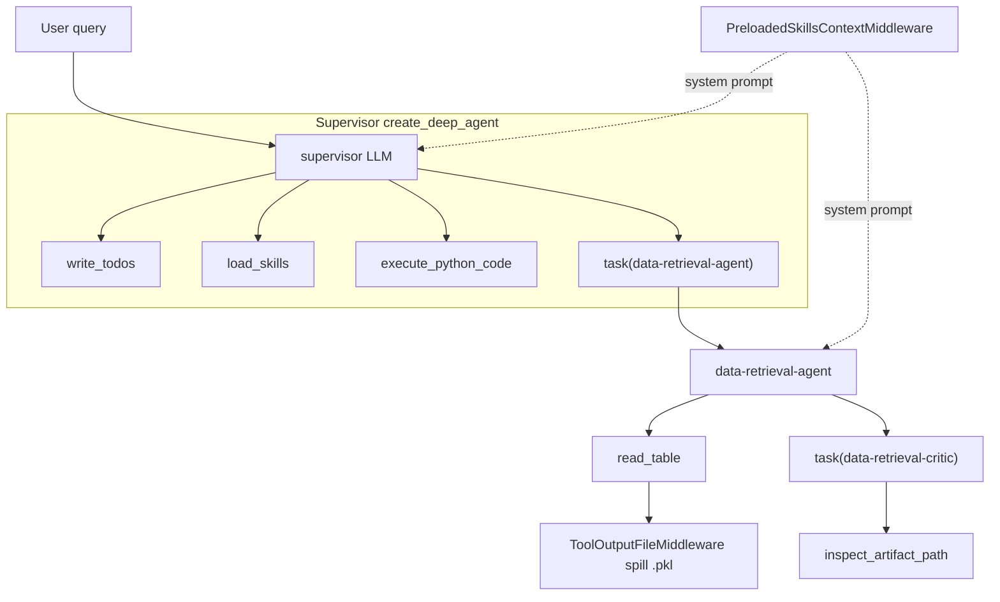

# Native Analytics DeepAgent

Тонкая обёртка над LangChain/DeepAgents для аналитики табличных данных. Агент собран
**нативно**: supervisor получает встроенные tools DeepAgents и минимум custom-кода. Все
доменные знания вынесены в skills, а не в prompts.

## Принцип разделения ответственности

| Где | Что лежит |
|---|---|
| **prompts** (`prompts.py`) | только общие инструкции: роль, использование `write_todos`, механизм skills, использование critic, стиль финального ответа. Никакой бизнес-логики, имён таблиц/полей и жёстких проверок. |
| **skills** (`skills/**/SKILL.md`) | всё доменное знание: имена таблиц, поля, форматы дат/времени, ключи связи, правила маршрутизации между источниками, ограничения. |
| **tool outputs** | фактическая схема и значения; имеют приоритет над skills, если расходятся. |

Три (и только три) custom-механизма поверх нативного DeepAgents:

1. **Offload файлов** — каждый табличный результат `read_table` сохраняется в `.pkl`
   (`ToolOutputFileMiddleware`); в контекст большие выборки по-прежнему приходят как preview,
   маленькие — inline + путь к файлу для переиспользования без повторного Spark-запроса.
2. **Принудительная загрузка skills** — LLM выбирает релевантные skills по запросу и их
   контент кладётся в system prompt до первого хода модели (`PreloadedSkillsContextMiddleware`
   + tool `load_skills`).
3. **Critic-агент** — внутренний `data-retrieval-critic` проверяет правдивость и
   достаточность шага чтения данных. Опционален: включается флагом
   `enable_retrieval_critic` (по умолчанию `true`). При `false` `data-retrieval-agent`
   отдаёт отчёт supervisor-у напрямую — без `task(data-retrieval-critic)` и без critic loop cap.

Поверх них подключены три **нативных** middleware LangChain/DeepAgents (без custom-логики):

- **Context editing** (`ContextEditingMiddleware` + `ClearToolUsesEdit`) — при достижении
  лимита токенов очищает старые tool-результаты, оставляя последние N (дополняет offload).
- **File search** (`FilesystemFileSearchMiddleware`) — добавляет glob/grep поиск по папке
  spill-файлов (`tool_outputs_dir`), чтобы находить нужные `.pkl` без полного перебора.
- **Loop guard** (`ToolLoopGuardMiddleware`, `tool_loop_guard_middleware.py`) — блокирует
  серию подряд идущих вызовов одного и того же tool после `max_consecutive_tool_calls`
  повторов (учитывает именно повторы подряд, а не идентичность аргументов, поэтому ловит и
  «варьирующие» циклы) и просит модель сменить подход или завершить шаг — без аварийного
  завершения прогона.
- **Critic loop cap** (`CriticLoopCapMiddleware`, `critic_loop_cap_middleware.py`) — ограничивает
  число циклов `task(data-retrieval-critic)` внутри `data-retrieval-agent` лимитом
  `max_critic_iterations` (по умолчанию 3); сверх лимита вызов критика блокируется, и агент
  обязан отдать финальный отчёт по уже полученным tool results. Подключается только при
  включённом critic (`enable_retrieval_critic: true`).
- **Subagent step limit** (нативный `ModelCallLimitMiddleware`) — ограничивает число ходов
  модели за один запуск `data-retrieval-agent` лимитом `max_subagent_model_calls` (по
  умолчанию 19); по исчерпании субагент мягко завершается (`exit_behavior="end"`) и
  возвращает supervisor-у уже собранный результат, не упираясь в recursion limit графа.

Loop guard и offload применяются и к supervisor, и к `data-retrieval-agent`; critic loop cap
и subagent step limit — только к `data-retrieval-agent`.

## Структура

- `analytics_deep_agent.py` — главная сборка: `build_analytics_deep_agent` с пошаговой
  инициализацией, backend skills и permissions.
- `prompts.py` — общие prompts supervisor, subagent и critic (без доменной логики).
- `agent_specs.py` — имена агентов и structured output `DataRetrievalCriticVerdict`.
- `retrieval_subagents.py` — сборка `data-retrieval-agent` с внутренним `task(data-retrieval-critic)`.
- `inspect_artifact_tool.py` — фактическая проверка spill-файлов для critic (без вердикта).
- `agent_state.py` — расширенный state для skills middleware.
- `skills_context_middleware.py` — LLM-выбор и preload skills по запросу пользователя.
- `tool_output_file_middleware.py` — offload больших tabular tool outputs в `.pkl`.
- `tool_loop_guard_middleware.py` — защита от зацикливания на повторных вызовах tool.
- `data_tools_wrapper.py` — слой прозрачности над `read_table`: возвращает агенту сгенерированный SQL-подобный код запроса и счётчики строк (всего/подошло/возвращено).
- `trace_logging.py` — `FileTraceCallbackHandler`: пишет в один txt-файл (в правильной последовательности, без обрезаний) system prompt, набор инструментов, ответы агента и ответы инструментов (только аргументы/content, без метаданных).
- `python_sandbox.py` — persistent sandbox с helpers `read_pickle_file`, `describe_pickle_file`, `rows_to_dataframe`.
- `execute_python_code_tool.py` — выполнение Python-кода с белым списком импортов и информативным JSON при ошибках.
- `load_skills_tool.py` — пакетная загрузка skills одним вызовом вместо нескольких `read_file`.
- `settings.py` + `config/defaults.json` — типизированная загрузка настроек.
- `run_native_analytics_chat.py` — терминальный запуск на тестовых CSV.
- `skills/` — domain skills (`SKILL.md`), доступные через `/skills/`.
- `data/` — тестовые CSV: `hits`, `cards_event`, `uko_event`.

## Архитектура и поток



- Supervisor планирует через `write_todos`, делегирует чтение в `data-retrieval-agent`,
  считает через `execute_python_code`, отвечает текстом.
- `data-retrieval-agent` читает через `read_table` и (если `enable_retrieval_critic: true`)
  перед ответом прогоняет внутренний `data-retrieval-critic` (supervisor этот цикл не видит).
  При `false` критик не подключается, и субагент отдаёт отчёт напрямую.
- `read_table` обёрнут слоем прозрачности (`data_tools_wrapper.py`): вместе с данными
  агент получает сгенерированный SQL-подобный код запроса и счётчики строк
  (всего в таблице / подошло под фильтры / возвращено). Если подошло больше, чем
  возвращено, агент видит предупреждение о неполной выборке. Для полного перечня
  уникальных значений нужно использовать `group_by` + `aggregations`, а не выборку строк.
- Каждый результат `read_table` сохраняется в `.pkl`; урезанные выборки из уже загруженного
  набора делаются через `execute_python_code` по pickle, а не повторным `read_table`
  (см. «Экономия Spark-запросов» в `prompts.py`). Большие выборки в контекст — preview;
  в summary офлоада — код запроса и путь к файлу.

## Шаги инициализации `build_analytics_deep_agent`

Функция в `analytics_deep_agent.py` собрана по нумерованным шагам (см. комментарии в коде):

1. **Settings** — пути skills, папка spill-файлов, пороги offload, `thread_id`.
2. **Data tools** — инструменты чтения данных (`read_table`).
3. **Middleware** — принудительная загрузка skills + offload tool outputs + нативные
   context editing, file search и кастомный loop guard.
4. **Backend + permissions** — read-only доступ к `/skills/**` и `/tool_outputs/**`.
5. **Subagents** — `data-retrieval-agent`; внутренний `data-retrieval-critic` подключается по флагу `enable_retrieval_critic`.
6. **Custom tools** — `execute_python_code` и `load_skills`.
7. **Сборка** — `create_deep_agent(...)` со всеми частями.

## Как кастомизировать и модифицировать агента

- **Свои данные**: передай `data_tools=[...]` (`BaseTool`) в `build_analytics_deep_agent`,
  либо укажи `data_tools_factory` (import path) и `data_tools_factory_kwargs` в конфиге.
- **Свой конфиг**: переопредели значения в `config/defaults.json` или подключи отдельный
  файл через `DEEP_AGENT_CONFIG_PATH` (он мёржится поверх defaults).
- **Новые домены**: добавь папку `skills/<name>/SKILL.md` с front matter `name`/`description`.
  Index и preload подхватят skill автоматически — менять prompts не нужно.
- **Поведение supervisor/critic**: правь только общие инструкции в `prompts.py`. Доменные
  правила в prompts не добавляй — их место в skills. Чтобы временно отключить внутренний
  critic, выстави `enable_retrieval_critic: false` в конфиге.
- **Новые subagents**: расширь `build_analytics_subagent_specs` в `retrieval_subagents.py`.
- **Пороги offload / размер skill-preview**: ключи `tool_output_*` и `max_chars_per_skill`
  в конфиге.
- **Context editing / file search / loop guard / лимиты**: ключи `context_edit_*`,
  `file_search_use_ripgrep`, `max_consecutive_tool_calls`, `max_subagent_model_calls` в
  конфиге. Если в рантайме доступен `rg`, можно включить `file_search_use_ripgrep: true`
  для ускорения поиска.

## Запуск

Демо использует тестовые CSV из `deep_agent_test/data` через `examples.fake_spark_tools`.
Модель берётся из корневого `model.py` (нужны API-ключи).

```powershell
uv run --extra deep-agent-test python deep_agent_test/run_native_analytics_chat.py
```

`main()` делает один `invoke` с demo-запросом и печатает все сообщения (`[Tool call]`,
`[Tool result]`, текст агента). Интерактивный режим: вызови `run_chat()` из Python.

## Логирование хода агента

Полный человекочитаемый лог хода агента пишется в один txt-файл через
`FileTraceCallbackHandler` (`trace_logging.py`). В нём в правильной последовательности и без
обрезаний фиксируются: system prompt (с учётом preload skills), набор инструментов (имя,
описание, схема аргументов), ответы агента (текст + вызовы инструментов с аргументами) и
ответы инструментов (content). Метаданные (run_id, usage, id) не пишутся.

Runner (`main()` / `run_chat()`) подключает логгер автоматически и печатает путь к файлу.
Папка задаётся ключом `trace_log_dir`. Чтобы подключить логгер к своему агенту, передай
handler в `config.callbacks` — он распространяется на supervisor, subagent-ов, critic и tools:

```python
from deep_agent_test.trace_logging import build_file_trace_handler

handler = build_file_trace_handler("runs/deep_agent_traces", label="my-run")
agent.invoke(
    {"messages": [{"role": "user", "content": "..."}]},
    config={"configurable": {"thread_id": "t1"}, "callbacks": [handler]},
)
print("Лог:", handler.file_path)
```

Альтернативный конфиг:

```powershell
$env:DEEP_AGENT_CONFIG_PATH="C:\path\to\deep_agent_config.json"
uv run --extra deep-agent-test python deep_agent_test/run_native_analytics_chat.py
```

## Конфигурация (`config/defaults.json`)

| Ключ | Назначение |
|---|---|
| `thread_id` | thread id LangGraph для чата |
| `skills_virtual_dir` | виртуальный путь skills в backend |
| `skills_root` | локальная папка skills |
| `data_tools_factory` | import path фабрики production tools (может быть `null`) |
| `data_tools_factory_kwargs` | kwargs для фабрики |
| `tool_outputs_dir` | папка для `.pkl` с большими tool outputs |
| `max_chars_per_skill` | лимит символов одного skill в preload context |
| `tool_output_min_rows_to_save` | порог строк для offload |
| `tool_output_min_content_chars_to_save` | порог символов content для offload |
| `tool_output_preview_rows` | число строк preview в summary |
| `tool_output_inline_original_chars` | лимит дублирования исходного content |
| `context_edit_trigger_tokens` | порог токенов, при котором context editing чистит старые tool-результаты |
| `context_edit_keep_tool_results` | сколько последних tool-результатов сохранять при очистке |
| `file_search_use_ripgrep` | использовать ли бинарник `rg` для file search (по умолчанию `false`) |
| `max_consecutive_tool_calls` | лимит подряд идущих вызовов одного tool (loop guard) |
| `max_subagent_model_calls` | бюджет ходов модели на один запуск data-retrieval-agent (native step limit) |
| `max_critic_iterations` | лимит циклов `task(data-retrieval-critic)` внутри data-retrieval-agent |
| `enable_retrieval_critic` | включать ли внутренний `data-retrieval-critic` (по умолчанию `true`; при `false` субагент отвечает supervisor-у напрямую) |
| `graph_recursion_limit` | бюджет супершагов графа на один `invoke`; при исчерпании runner отдаёт частичный прогресс вместо краха |
| `trace_log_dir` | папка для txt-логов хода агента (`FileTraceCallbackHandler`) |

## execute_python_code

Persistent sandbox между вызовами в одной сессии. Helpers (импорт не нужен):
`read_pickle_file(path)`, `describe_pickle_file(path)`, `rows_to_dataframe(rows)`,
`PROJECT_ROOT`, `TOOL_OUTPUTS_DIR`, `pd`, `np`.

Импорт ограничен белым списком; запрещены `eval`/`exec`/`os.system` и удаление файлов.
При ошибке tool возвращает JSON с `error`, `traceback`, `execution_output`,
`possible_causes`, `solution_options`, `retry_guidance`, `available_variables`,
`sandbox_helpers`, `readable_roots` — этого достаточно, чтобы исправить код и повторить.

## Тесты

```powershell
python -m pytest tests/test_retrieval_critic.py tests/test_supervisor_prompt_context.py `
  tests/test_native_analytics_chat_runner.py tests/test_execute_python_code_tool.py `
  tests/test_sandbox_code_executor.py tests/test_tool_output_file_middleware.py `
  tests/test_data_tools_wrapper.py tests/test_fake_spark_tools.py -q
```
